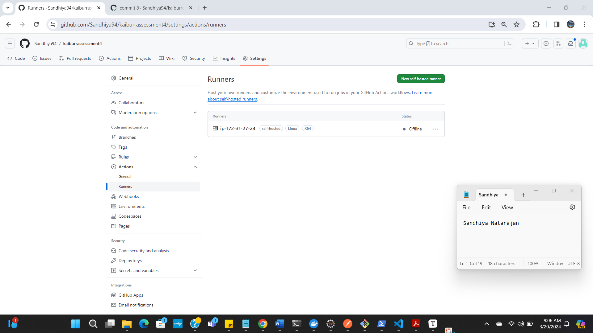

## Task 4: CI-CD Pipeline

### Overview

In this task, we created a CI-CD pipeline for a sample Flask application(Task 3) interacting with springboot + MongoDB(Task 1) using GitHub Actions as the CI-CD tool.

**CI/CD Tool:** GitHub Actions
**Application:** Flask application(Task 3 - https://github.com/Sandhiya94/kaiburrassessment4.git) & springboot + MongoDB(Current Repo)
**CI Workflow:** ci.yml (under .github/workflows)
**CD Workflow:** cd.yml(under .github/workflows)

*CI/CD is implemented for both Flask and springboot applications. It can be found under **.github/workflows in both the git repos**

### CI Pipeline

The CI Pipeline is triggered on every push to the `main` branch of the repository. It is defined in the `docker_image.yml` file. 

1. **Checkout**: Clones the repository code.
2. **Login Dockerhub**: Authenticates with DockerHub using provided credentials.
3. **Build the Docker image**: Builds the Docker image for the sample application.
4. **Push to Dockerhub**: Pushes the built Docker image to DockerHub.

### CD Pipeline

The CD Pipeline is triggered after the completion of the CI Pipeline. It is defined in the `cd.yml` file. 

1. **Pull Docker image**: Pulls the latest Docker image of the sample application from DockerHub.
2. **Delete Old docker container**: Removes any existing container instances of the application.
3. **Run Docker Container**: Runs a new container instance of the application using the pulled Docker image.

### Screenshots

#### GitHub Actions


Flask Application Actions


CI Pipeline(Spring boot)


CD Pipeline(Spring boot)


Springboot Actions:


CD Pipeline(Spring boot)


CI Pipeline(Spring boot)


#### Runners




#### Application Screen from EC2


```

```

